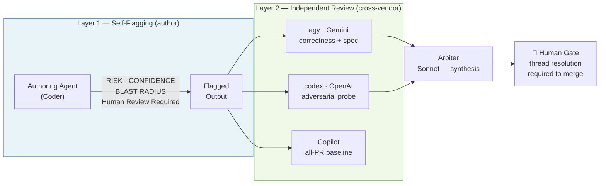
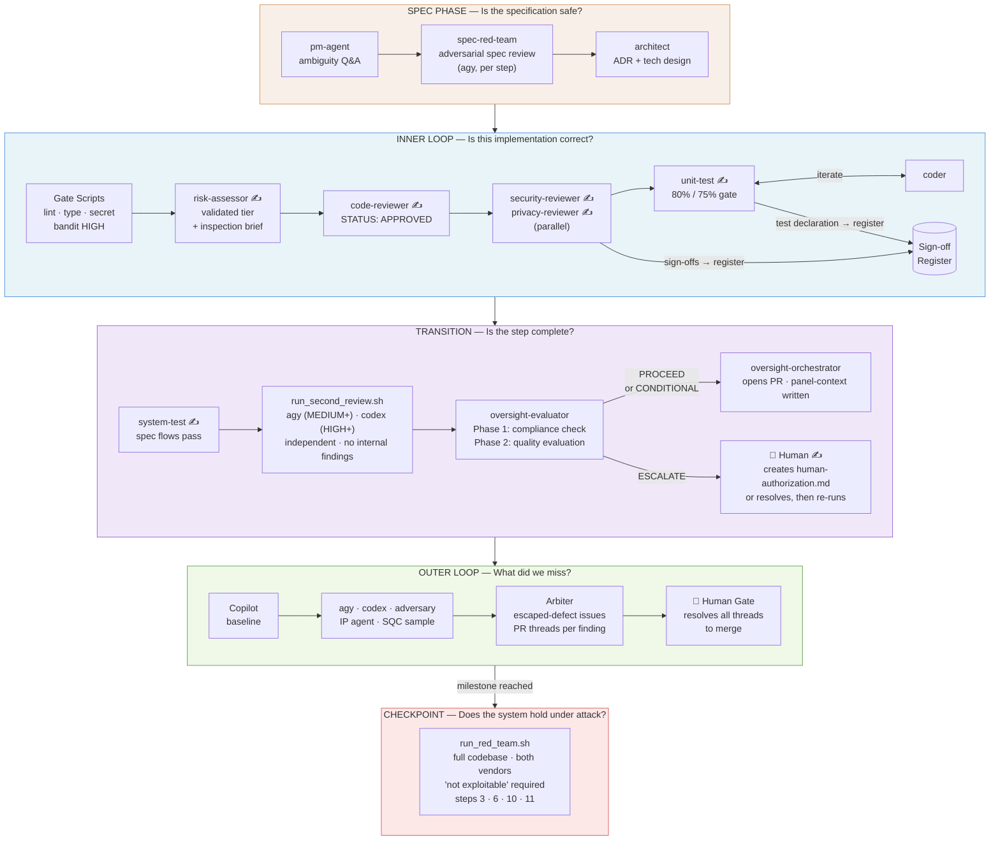
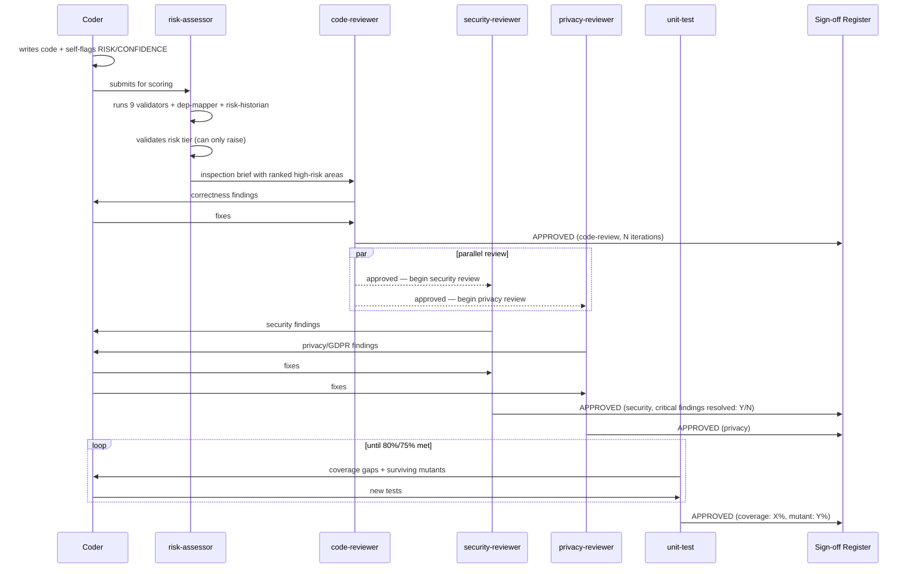
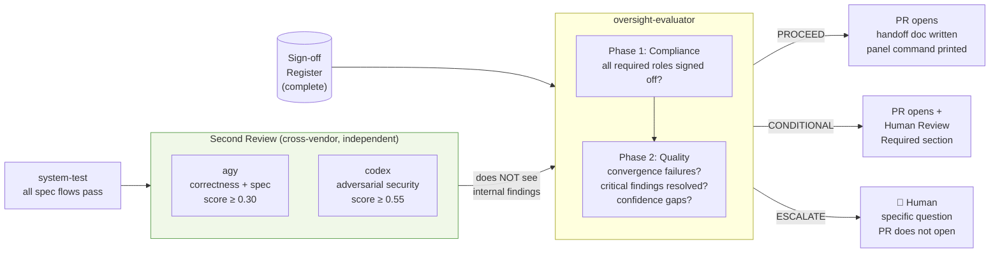
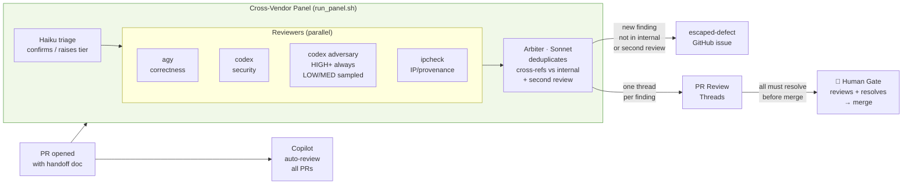
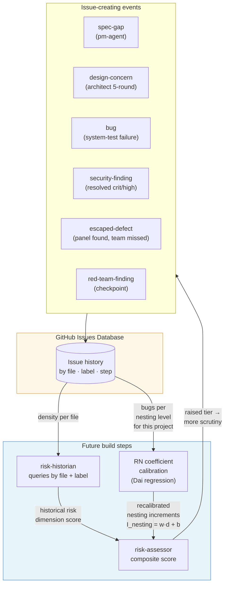
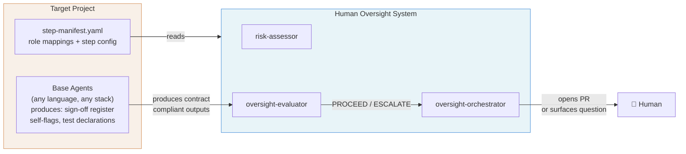
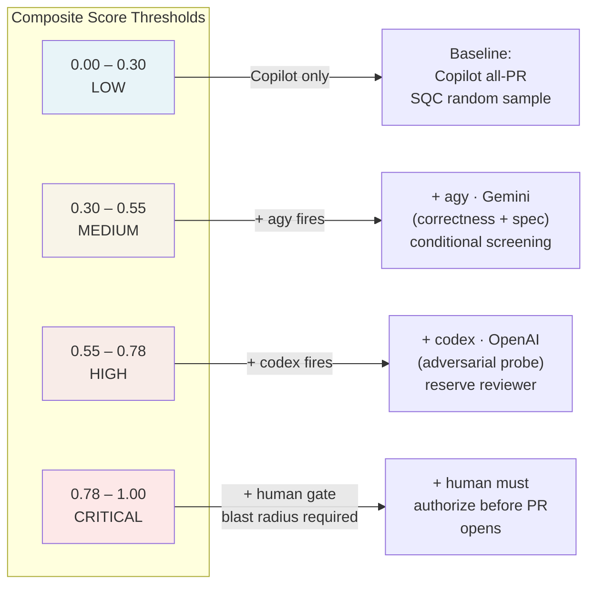

# Human Oversight System — Architecture

How the agents work together to scale human oversight of AI-generated code.

---

## The Problem

AI generates code faster than humans can review it. Worse, AI-generated code fails differently from human code: plausible-but-wrong logic, hallucinated APIs, security antipatterns that *look* correct. The failure modes are subtle, the volume is high, and the instinct to trust fluent output is strong — automation bias working against the reviewer.

Reviewing everything exhaustively doesn't scale. Trusting blindly is reckless.

**The thesis:** route human attention by risk. Make the oversight signal visible and stratified — so a human reviews the ~10% that matters line-by-line and spot-checks the rest. The mechanism is a system of checks and balances across multiple, independent AI agents, escalating to a human as risk rises.

---

## Two Layers of Protection

**Layer 1 (self-flagging)** is what the authoring agent does to its own work: classify risk, declare confidence, assess blast radius, flag the specific lines that need human eyes. This is the foundation — every change ships with a risk signal before any reviewer sees it.

**Layer 2 (independent review)** is why self-flagging alone isn't enough. An AI is poor at catching its own class of mistakes — the same training distribution that caused the bug also makes it hard to spot. Cross-vendor, independent reviewers decorrelate the error space. What Claude misses, Gemini or GPT-4 may catch.

The two layers compose: author self-flags → independent reviewers scrutinize → human decides. The human's job is not to re-read every line, but to resolve the specific threads that automated review could not close.

---

## The Agent Roster

### HOS Oversight Agents
*These live in `.claude/agents/` in this repo and are installed into target projects. They evaluate the review process itself — not the application code.*

| Agent | Model | Role |
|---|---|---|
| **risk-assessor** | Sonnet | Runs after coding, before reviewers. Applies deterministic floor rules, runs all 9 validator scripts (including `ip_check.py` and `prompt_audit_risk.py`), scores the code, validates the risk tier (can only raise), and produces a ranked inspection brief. Calls `prompt-fidelity` subagent at MEDIUM+ when prompt artifacts exist. |
| **dep-mapper** | Sonnet | Subagent of risk-assessor at HIGH+. Generic interface: builds dependency graph for changed files (fan-in, signal connections, framework wiring). Projects override with stack-specific version (e.g. CondoParkShare provides a Django-specific dep-mapper). |
| **risk-historian** | Haiku | Subagent of risk-assessor. Queries GitHub issues and git log for historical bug density and churn. Starts empty; accumulates value as issues are filed. |
| **prompt-fidelity** | Sonnet | Subagent of risk-assessor at MEDIUM+ when a prompt artifact exists. Semantic comparison of prompt/design-doc to generated code: identifies unexplained additions, missing specifications, loose interpretations. Returns structured fidelity score. |
| **spec-red-team** | Sonnet | Runs before coding begins on each build step. Uses agy adversarially to find gaming vectors, contradictions, and implicit assumptions in the spec before implementation. Creates `spec-gap` issues. |
| **oversight-evaluator** | Sonnet | Runs after all internal reviewers have approved and system tests pass. Phase 1: compliance — sign-off register has all required entries with required fields (Status/Agent/Artifact/Iterations), prompt artifacts present on MEDIUM+ commits, human authorization file for CRITICAL steps. Phase 2: quality — convergence failures, resolved critical findings, confidence gaps. Produces: PROCEED / CONDITIONAL\_PROCEED / ESCALATE. |
| **oversight-orchestrator** | Sonnet | Acts on evaluator's recommendation. Writes two separate files: `step{N}-panel-context.md` (structural risk signals only — no internal findings) for the panel, and `step{N}-handoff.md` (full picture) for the human/PR. ESCALATE → surfaces specific questions, PR does not open. |

### Base Project Agents
*Defined in the target project (e.g. CondoParkShare). They implement the HOS contract — the oversight agents consume their outputs without knowing their names.*

| Role | What it produces | Contract output |
|---|---|---|
| **pm-agent** | Spec clarifications, test plan sign-offs | `spec-gap` issues on escalation; sign-off register entry |
| **architect** | ADR, design critiques | `design-concern` issues on 5-round loops; sign-off register entry |
| **technical-design** | Implementation contract (TECHNICAL-DESIGN.md) | Sign-off register entry on approval |
| **coder** | Application code + self-flags | RISK / CONFIDENCE / BLAST RADIUS in output; git trailers |
| **code-reviewer** | Correctness, idioms, design adherence | Sign-off register entry; iterates with coder |
| **security-reviewer** | Security vulnerabilities (OWASP, threat-model) | `security-finding` issues for crit/high; sign-off register entry |
| **privacy-reviewer** | GDPR compliance, PII handling | `privacy-finding` issues for blocking findings; sign-off register entry |
| **unit-test** | 80% coverage + 75% mutant score | `test-resistance` issues on loop exhaustion; test declaration in register |
| **system-test** | Spec flow conformance | `bug` issues for persistent failures; sign-off register entry |

### External Reviewers
*Run via CLI, never see internal reviewer findings — independence is the value.*

| Reviewer | Tier | Lens | When fires |
|---|---|---|---|
| **Copilot** | GitHub Pro | Broad code review | All PRs, automatic |
| **agy (Gemini)** | Gemini Pro (conditional screening — upgradeable) | Correctness + spec adherence | score ≥ 0.30 (MEDIUM+) |
| **codex (OpenAI)** | ChatGPT Pro (reserve — kept scarce by design) | Adversarial security probe | score ≥ 0.55 (HIGH+) |
| **Arbiter (Sonnet)** | Claude Max | Synthesis + escaped-defect detection | After each panel run |

---

## The Full Pipeline

Five phases, each answering a different question, each cheaper than the next.

---

## Sign-off Accountability

Every approval in the pipeline is a named sign-off written to the sign-off register. This table shows who approves what, at which phase, and what happens when approval is withheld.

| Phase | Who signs off | What they approve | Withheld → |
|---|---|---|---|
| **Spec** | pm-agent | Confirmed requirements | `spec-gap` issue → human |
| **Spec** | architect | ADR (architecture decisions) | Escalate to human |
| **Spec** | technical-design | Design approved for implementation | Revise + iterate |
| **Spec** | pm-agent | System test plan (before tests written) | `spec-gap` issue; coder waits |
| **Inner loop** | risk-assessor | Risk tier validated (can only raise) | Tier raised; inspection brief re-scoped |
| **Inner loop** | code-reviewer | Correctness, idioms, design adherence | Coder fixes; up to 5 rounds then architect |
| **Inner loop** | security-reviewer | Security posture (OWASP, threat model) | Coder fixes; `security-finding` issue if crit/high resolved |
| **Inner loop** | privacy-reviewer | GDPR / PII handling | Coder fixes; `privacy-finding` issue if blocking |
| **Inner loop** | ui-reviewer / a11y-reviewer | Template and accessibility conformance | Coder fixes |
| **Inner loop** | infra-reviewer | Docker/Caddy/env config | Coder fixes |
| **Inner loop** | unit-test | 80% coverage + 75% mutant score | Coder adds tests; `test-resistance` issue after 5 rounds |
| **Transition** | system-test | All spec flows passing | Coder fixes; `bug` issue after 5 rounds |
| **Transition** | agy (second review) | Correctness + spec adherence (independent) | CONDITIONAL_PROCEED or ESCALATE |
| **Transition** | codex (second review) | Adversarial security probe (independent) | CONDITIONAL_PROCEED or ESCALATE |
| **Transition** | oversight-evaluator | All required sign-offs present; quality assessment | ESCALATE → human blocks PR |
| **Transition** | 🧑 Human (CRITICAL only) | Creates `step{N}-human-authorization.md` | evaluator refuses to proceed |
| **Outer loop** | Copilot | Baseline code review (all PRs, automatic) | PR thread created |
| **Outer loop** | agy / codex panel | Cross-vendor independent review | PR thread per finding (blocks merge) |
| **Outer loop** | Sonnet arbiter | Synthesizes findings; files escaped-defect issues | `escaped-defect` issue created |
| **Outer loop** | 🧑 Human | Resolves every PR thread | Merge blocked until all resolved |
| **Checkpoint** | codex + agy (red-team) | System-level adversarial attestation | `red-team-finding` issue; human decides |

The sign-off register (`.claudetmp/signoffs/step{N}-register.md`) is the audit trail. The oversight-evaluator reads it in Phase 1 of every step evaluation and fails compliance if required entries are missing.

---

## Phase Detail

### Spec Phase — before any code

The spec red-team runs **before each build step** on the relevant spec section. It uses agy adversarially — independently from the pm-agent that wrote the spec — to find gaming vectors ("can a resident game the horizon calculation?"), contradictions, and implicit assumptions. Findings become `spec-gap` issues. The pm-agent addresses them before coding starts.

This is the cheapest possible fix: a spec amendment takes minutes. The same problem found after implementation requires a code rewrite plus test changes.

### Inner Loop — per build step

The **inspection brief** from the risk-assessor is what makes the reviewers efficient. Instead of reading the whole function, they start at the highest-scored statements with specific checklist questions derived from Dai et al.'s Risk Number and domain-specific signals (trust boundary crossings, authentication distance, PII proximity). A reviewer working from the brief finds more bugs in less time.

### Transition — pre-PR gate

The second reviewers receive the diff, the risk scores, and the spec — but **not** the internal reviewers' findings. This is the independence invariant. If agy sees that code-reviewer already flagged line 84, it anchors to that finding and loses its value as a second opinion. The oversight-evaluator later compares all three sets of findings; agreement builds confidence, divergence surfaces uncertainty.

### Outer Loop — PR-level formal review

The arbiter's cross-referencing step is where **escaped defects** are identified: panel findings that weren't in the internal sign-off register and weren't in the second review output. These are filed as `escaped-defect` issues and become the denominator for the oversight system's key metric.

### Checkpoint Red-Team — system-level, 4× per project

The change-level reviews (inner loop, second review, panel) all see a diff. They cannot see attack chains that span multiple build steps. The checkpoint red-team reads the **full codebase as a target** and tries to construct end-to-end exploits.

| Checkpoint | After step | Scope |
|---|---|---|
| Auth | Step 3 | TOTP replay chains, session fixation, invite token abuse |
| Booking | Step 6 | Horizon metric gaming, concurrent booking exploits |
| Admin | Step 10 | Privilege escalation, cross-tenant admin access |
| Deploy | Step 11 | Infrastructure: TLS, headers, DB exposure |

Every red-team report is required to include **"not exploitable" attestations** — explicit claims about attack vectors that were tested and found safe. A clean finding list without attestations is ambiguous. An explicit "I attempted these 12 attack vectors and found none exploitable" is a positive claim that can be challenged.

---

## The Feedback Loops

The system improves over time. Issue creation is not just governance — it's the mechanism that makes the risk assessor smarter on every subsequent step.

**Loop 1 — Historical density:** Every issue created (bug, security-finding, escaped-defect) is tagged with the file it came from. The risk-historian queries these on future steps. A file with three prior `escaped-defect` issues gets a higher historical density score → the composite score rises → more scrutiny is applied → more bugs are found → the loop compounds.

**Loop 2 — RN coefficient calibration:** Dai et al.'s Risk Number uses regression-derived nesting increment coefficients calibrated from their lab's data. As the project accumulates bug data (from `bug` and `security-finding` issues), the coefficients can be recalibrated to this specific project, team, and LLM family. Over time, the Risk Number becomes a better predictor of *this codebase's* fault distribution, not a generic one.

**The escaped-defect metric** is the headline research instrument: what fraction of HIGH/CRITICAL steps have something that the full internal review chain, second review, AND the panel all missed? As the system matures, that rate should fall — which is empirical evidence that the oversight calibration is working.

---

## The Contract — Portability

The oversight agents do not know or care about the specific agents in any given project. They program against a contract (`contract/OVERSIGHT-CONTRACT.md`) that defines:

- **Filesystem protocol** — where the sign-off register, temp files, and test declarations live
- **Self-flag format** — what code-producing agents must emit (RISK / CONFIDENCE / BLAST RADIUS)
- **Sign-off schema** — what reviewing agents must write to the register on approval
- **Role mappings** — which project agent fills which oversight role (code-review, security, privacy, etc.)
- **Step manifest** — project config describing each build step, baseline risk tier, and required roles

Any agent team that produces contract-compliant outputs gets the full oversight layer. The oversight agents are a drop-in layer, not a replacement for the base team.

---

## Risk Stratification — What Triggers What

The composite score from the validator scripts maps to a tier, which controls how much scrutiny fires.

The score can only be **raised**, never lowered: the coder's self-declared tier is a floor. The risk-assessor applies deterministic rules (file path patterns, operation types) and then the composite validator score. The oversight-evaluator can raise further based on what reviewers found. The final tier is the maximum across all three.

The two external vendor subscriptions are allocated by design: agy (Gemini) is the **conditional screening** reviewer that fires often at MEDIUM+ — its subscription tier is intentionally upgradeable to lower the score threshold further. codex (OpenAI) is the **reserve** reviewer, kept deliberately scarce and triggered only at HIGH+ where adversarial thinking pays off most. Lowering the codex threshold would increase cost without proportional value gain — the scarcity is by design, not budget constraint.

---

## Summary

The system scales oversight by doing three things:

1. **Routing attention by risk** — the risk assessor's inspection brief tells reviewers exactly where to look. Reviewers don't read everything; they read the right things.

2. **Decorrelating review** — same-vendor review correlates errors. Cross-vendor, independent review in the outer loop catches what the inner loop shares as a blind spot.

3. **Compounding over time** — every issue created feeds the historical risk database. Future steps on historically buggy files get more scrutiny. The system gets better at predicting where defects will be.

The human is not removed from the process — they are *routed* to the decisions only they can make: resolving genuine ambiguities, approving blast-radius operations, and closing the threads that automated review cannot close on its own.
