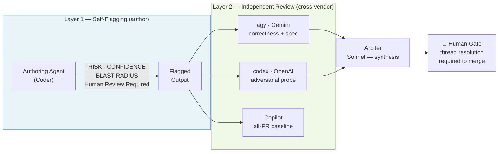
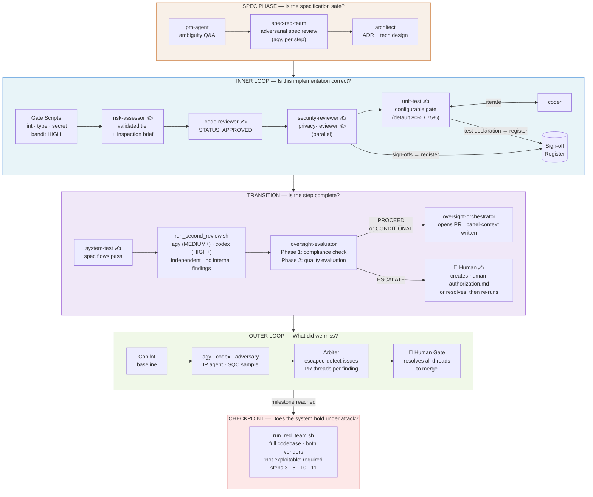
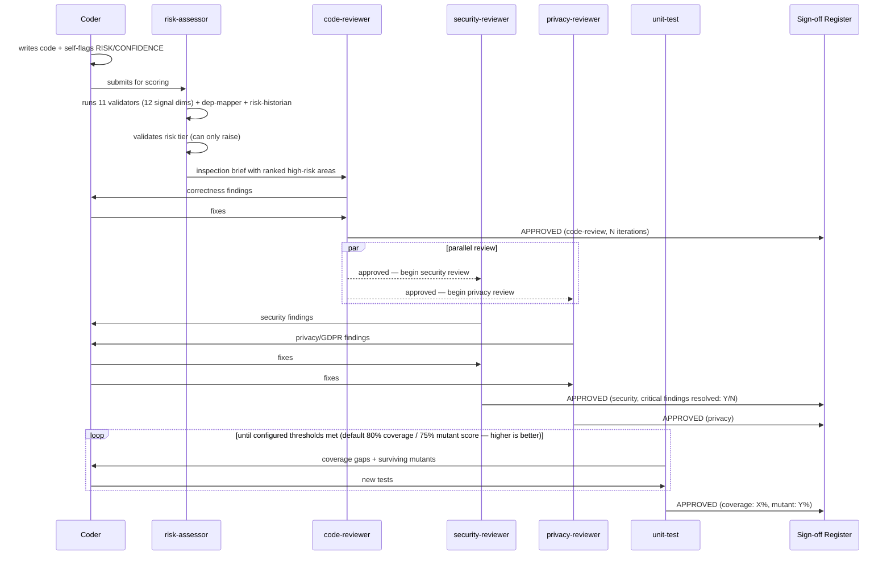
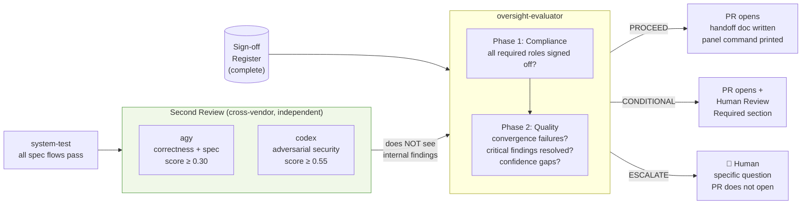
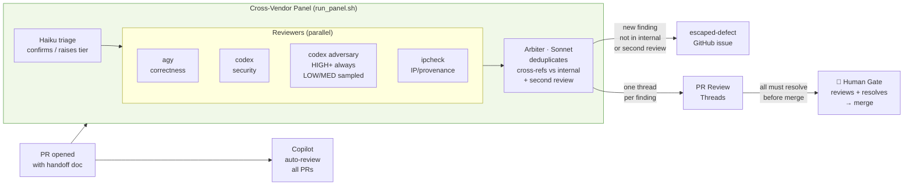
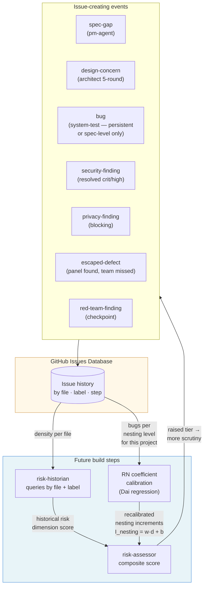
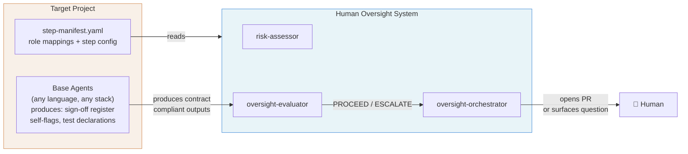
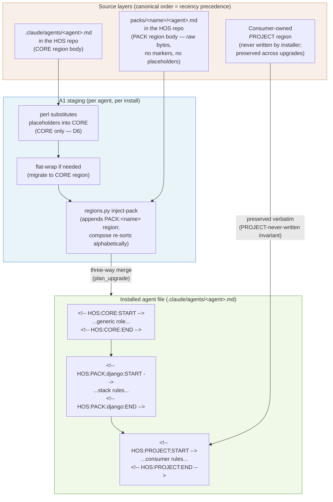
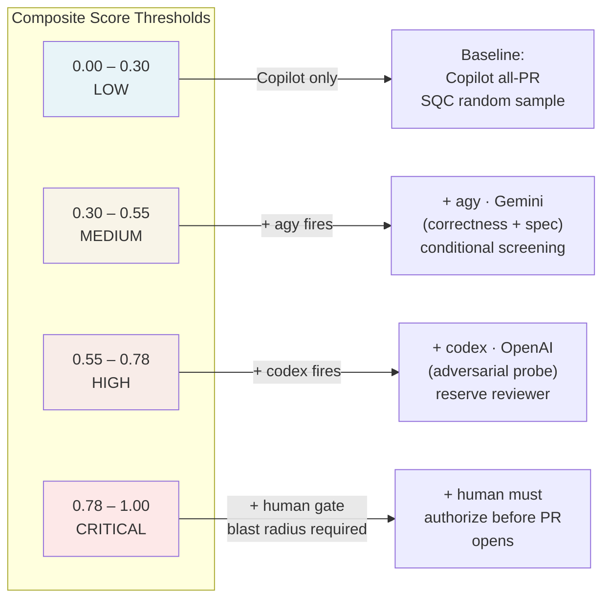

# Human Oversight System — Architecture

How the agents work together to scale human oversight of AI-generated code.

---

## The Problem

AI generates code faster than humans can review it. Worse, AI-generated code fails differently from human code: plausible-but-wrong logic, hallucinated APIs, security antipatterns that *look* correct. The failure modes are subtle, the volume is high, and the instinct to trust fluent output is strong — automation bias working against the reviewer.

Reviewing everything exhaustively doesn't scale. Trusting blindly is reckless.

**The thesis:** route human attention by risk. Make the oversight signal visible and stratified — so a human reviews the ~10% that matters line-by-line and spot-checks the rest. The mechanism is a system of checks and balances across multiple, independent AI agents, escalating to a human as risk rises.

---

## Two Layers of Protection

**Layer 1 (self-flagging)** is what the authoring agent does to its own work: classify risk, declare confidence, assess blast radius, flag the specific lines that need human eyes. This is the foundation — every change ships with a risk signal before any reviewer sees it.

**Layer 2 (independent review)** is why self-flagging alone isn't enough. An AI is poor at catching its own class of mistakes — the same training distribution that caused the bug also makes it hard to spot. Cross-vendor, independent reviewers decorrelate the error space. What Claude misses, Gemini or GPT-4 may catch.

The two layers compose: author self-flags → independent reviewers scrutinize → human decides. The human's job is not to re-read every line, but to resolve the specific threads that automated review could not close.

---

## The Agent Roster

### Findings routing: issues vs. PR threads

The rule is simple: **would a human doing this work in the inner loop file a GitHub issue?**

A developer reviewing a PR does not open issues for "add a test here" or "this function needs a null check." Those are PR comments — they live and die with the PR, and their resolution is visible in the thread. Agents follow the same convention.

**Use a GitHub issue when:**
- The finding is a project-level concern that survives branch merges — spec gaps, security vulnerabilities, architectural decisions, red-team findings
- The `risk-historian` needs to see it — historical bug density is computed from issues, not PR threads
- The finding may affect future branches or sessions, not just the current change

**Use a PR thread when:**
- The finding is a correction the coder should address in the current inner loop — test coverage, null checks, style, reviewer iteration
- The work item closes naturally when the PR merges or is abandoned
- A human reviewer would say it rather than file it

**All issues created by agents must include `Branch:` and `PR:` fields** in the body, so the context is explicit if the branch is later abandoned or the issue outlives its original PR.

### HOS Oversight Agents
*These live in `.claude/agents/` in this repo and are installed into target projects. They evaluate the review process itself — not the application code.*

| Agent | Model | Role |
|---|---|---|
| **risk-assessor** | Sonnet | Runs after coding, before reviewers. Applies deterministic floor rules, runs all 9 validator scripts (including `ip_check.py` and `prompt_audit_risk.py`), scores the code, validates the risk tier (can only raise), and produces a ranked inspection brief. Calls `prompt-fidelity` subagent at MEDIUM+ when prompt artifacts exist. |
| **dep-mapper** | Sonnet | Subagent of risk-assessor at HIGH+. Generic interface: builds dependency graph for changed files (fan-in, signal connections, framework wiring). Projects override with stack-specific version (e.g. CondoParkShare provides a Django-specific dep-mapper). |
| **risk-historian** | Haiku | Subagent of risk-assessor. Queries GitHub issues and git log for historical bug density and churn. Starts empty; accumulates value as issues are filed. |
| **prompt-fidelity** | Sonnet | Subagent of risk-assessor at MEDIUM+ when a prompt artifact exists. Semantic comparison of prompt/design-doc to generated code: identifies unexplained additions, missing specifications, loose interpretations. Returns structured fidelity score. |
| **spec-red-team** | Sonnet | Runs before coding begins on each build step. Uses agy adversarially to find gaming vectors, contradictions, and implicit assumptions in the spec before implementation. Creates `spec-gap` issues. |
| **oversight-evaluator** | Sonnet | Runs after all internal reviewers have approved and system tests pass. Phase 1: compliance — sign-off register has all required entries with required fields (Status/Agent/Artifact/Iterations), prompt artifacts present on MEDIUM+ commits, human authorization file for CRITICAL steps. Phase 2: quality — convergence failures, resolved critical findings, confidence gaps. Produces: PROCEED / CONDITIONAL\_PROCEED / ESCALATE. |
| **oversight-orchestrator** | Sonnet | Acts on evaluator's recommendation. Writes two separate files: `step{N}-panel-context.md` (structural risk signals only — no internal findings) for the panel, and `step{N}-handoff.md` (full picture) for the human/PR. ESCALATE → surfaces specific questions, PR does not open. All AI-submitted PRs include `[AI: oversight-orchestrator]` title prefix and a 🤖 attribution block. |
| **framework-validator** | Sonnet | Runs the full 4-phase validation suite before any framework file is committed. Delegates fixes to domain owners; escalates to human for broken escalation chains. Loop exit: 3 cycles max. |
| **framework-setup-validator** | Sonnet | Verifies a framework installation is complete — all agent files present, scripts executable, config populated. Invoked after `bootstrap/hos_install.sh` in a new project. |
| **doc-validator** | Sonnet | Catches the omission class of documentation bug (agent file says X and Y, doc says only X). Reads `doc-patterns.md` and `decisions.md` for prior-session context. Loop exit: 3 cycles max. |
| **spec-compliance-validator** | Sonnet | Verifies the pipeline implementation satisfies its governance spec (METHODOLOGY.md, AGENTS.md): cross-vendor independence, risk tiers, human gates, model assignments, loop exits. Checks `decisions.md` verification criteria. |
| **post-change-sweep** | Sonnet | After any change: reads git diff, categorizes files by domain (framework/code/templates/infra/design/spec), drives all relevant agents in dependency order across parallel tracks. |

### Base Project Agents

**[CondoParkShare](https://github.com/ScottThurlow/CondoParkShare)** is the reference implementation of a HOS-governed project. It is a real parking management application for condo communities — residents book shared parking spaces, HOA admins configure availability, and operators manage multi-building deployments. It was built specifically to exercise the HOS framework against genuine real-world complexity: multi-tenant data isolation, authentication flows, time-based booking logic with business rule gates, and administrative portals. The goal is dual-purpose: stress-test the framework on a domain with meaningful security and correctness requirements while delivering something useful to an actual user community.

The agents below are defined in CondoParkShare (and any other HOS-governed project). They implement the HOS contract — the oversight agents in this repo consume their outputs without knowing their names.

**These base agents are the signal layer.** Every role below *measures or detects* something and emits a signal — the coder emits self-flags (RISK/CONFIDENCE/BLAST RADIUS), each reviewer emits a sign-off carrying findings, the test agents emit coverage/conformance results. The **oversight layer** — `risk-assessor`, `oversight-evaluator`, `oversight-orchestrator` in *this* repo — does not generate signals; it *acts* on them (aggregates, stratifies, routes, gates, escalates, audits). Several base roles (`unit-test` coverage, `code-reviewer` maintainability, `reliability-reviewer`) double as software-quality signals — a benefit of the pipeline, but the research subject is what the oversight layer does with the aggregate, not any single reviewer's finding. The signal set is extensible: a project adds reviewers/validators (#80) and the oversight layer consumes them unchanged.

| Role | What it produces | Contract output |
|---|---|---|
| **pm-agent** | Spec clarifications, test plan sign-offs | `spec-gap` issues on escalation; sign-off register entry |
| **architect** | ADR, design critiques | `design-concern` issues on 5-round loops; sign-off register entry |
| **ux-designer** | Design pack authority — tokens, components, copy rules, feedback states. Proactive project-start audit + reactive gap-filling. 4th authority tier (peer to architect and pm-agent within design domain). | `docs/design/UX-DESIGN-READINESS.md` at project start; design pack updates; notifies a11y-reviewer and ui-reviewer after additive changes |
| **technical-design** | Implementation contract (TECHNICAL-DESIGN.md) | Sign-off register entry on approval |
| **coder** | Application code + self-flags | RISK / CONFIDENCE / BLAST RADIUS / VERIFY in output; git trailers |
| **code-reviewer** | Correctness, idioms, design adherence | Sign-off register entry; iterates with coder |
| **security-reviewer** | Security vulnerabilities (OWASP, threat-model) | `security-finding` issues for crit/high; sign-off register entry |
| **privacy-reviewer** | GDPR compliance, PII handling | `privacy-finding` issues for blocking findings; sign-off register entry |
| **ui-reviewer** | Design pack conformance — tokens, components, copy, voice/tone | Sign-off register entry; escalates gaps to ux-designer |
| **a11y-reviewer** | WCAG AA accessibility — keyboard, contrast, motion, responsiveness | Sign-off register entry; escalates token contrast failures to ux-designer |
| **ops-designer** | Observability authority — produces `TELEMETRY-SPEC.md` at project start; fills spec gaps reactively when `ops-reviewer` escalates. Escalates structural observability architecture changes to human. | `docs/ops/TELEMETRY-SPEC.md` at project start; spec updates; notifies `ops-reviewer` after additive changes. `architect` signs off on spec. |
| **ops-reviewer** | Telemetry spec conformance — structured logging, metrics, tracing, health checks, dashboard intent, runbook coverage per `TELEMETRY-SPEC.md`. N/A for projects without operational complexity. | Sign-off register entry; escalates spec gaps to `ops-designer` |
| **reliability-reviewer** | Resilience review — timeouts on outbound connections, retry with backoff, graceful degradation, no unbounded waits. N/A for projects without external dependencies. | Sign-off register entry; escalates structural reliability concerns to `architect` |
| **infra-reviewer** | Deployment config — Compose, reverse proxy, backup, env | Sign-off register entry |
| **unit-test** | Coverage % + mutant score, both configurable per project (higher is better; defaults: 80% coverage / 75% mutant score) | PR thread on coverage/mutant failures (inner loop correction); test declaration in register |
| **system-test** | Spec flow conformance | PR thread for failures fixable in current session; `bug` issue only if failure persists across sessions or affects spec correctness beyond the current branch; sign-off register entry |
| **deploy-verify** | Production smoke tests — TLS, DNS, services, browser | Escalates to infra-reviewer (infra) or coder (functional) |

### External Reviewers
*Run via CLI, never see internal reviewer findings — independence is the value.*

| Reviewer | Lens | When fires |
|---|---|---|
| **Copilot** | Broad code review | All PRs, automatic |
| **agy (Gemini)** | Correctness + spec adherence | score ≥ 0.30 (MEDIUM+) |
| **codex (OpenAI)** | Adversarial security probe | score ≥ 0.55 (HIGH+) |
| **Arbiter (Sonnet)** | Synthesis + escaped-defect detection | After each panel run |

#### Selection principles

**Decorrelated error spaces — the core rationale.** Different vendors train on different data distributions and optimize for different objectives. This means they fail differently: a subtle bug that one model's training makes it likely to miss is not necessarily invisible to a model trained differently. Cross-vendor review reduces the probability that all reviewers share the same blind spot. A panel of three Claude models would provide less independent signal than one Claude, one Gemini, and one OpenAI model — even if the Claude models were individually more capable.

**Role-capability matching.** Each external reviewer is assigned the lens that best matches its demonstrated strengths:
- **Copilot** runs on every PR automatically via GitHub's native integration — zero friction, no local invocation needed. It is the always-on floor precisely because it costs nothing incremental and catches a broad class of issues without configuration. Its value is coverage, not depth.
- **agy (Gemini)** brings a large context window well-suited to spec-adherence review: comparing an implementation against a requirements document benefits from holding both in context simultaneously. It fires at MEDIUM+ as a conditional screening pass — the majority of changes get this lens.
- **codex (OpenAI)** is reserved for HIGH+ as the adversarial security probe. Adversarial reasoning — constructing attack chains, finding trust boundary violations, probing for exploit combinations — is where a differentiated second opinion has the most value. Keeping it scarce also maintains signal quality: a reviewer that fires on everything becomes noise; one that fires on genuinely high-risk changes carries more weight.
- **Arbiter (Sonnet)** synthesizes the panel findings rather than adding another independent vote. Synthesis requires holding the full build context — spec, internal findings, panel findings — and producing a coherent verdict. Claude Sonnet is appropriate here because it has built-in context on the HOS pipeline; the author exclusion rule (no Claude as independent reviewer) applies to the independent voting round, not to synthesis.

**Author exclusion.** The authoring vendor (Claude/Anthropic) never casts an independent review vote. Same-family models share training biases and are more likely to ratify each other's mistakes. Sonnet is the arbiter — synthesis, not independent review. The independent votes are always cross-vendor.

**Independence preservation.** External reviewers read `panel-context.md` only — structural signals, no internal findings. They cannot anchor on conclusions the internal reviewers already reached. This is the mechanism that makes their signal genuinely independent rather than a restatement of the internal review with different phrasing.

---

## The Full Pipeline

Five phases, each answering a different question, each cheaper than the next.

---

## Sign-off Accountability

Every approval in the pipeline is a named sign-off written to the sign-off register. This table shows who approves what, at which phase, and what happens when approval is withheld.

Read this table through the signal/oversight split: most rows are **signal generators** — a reviewer or test emitting a sign-off that carries findings. A handful are the **oversight layer acting on those signals**: `risk-assessor` (validates and can only raise the tier), `oversight-evaluator` (gates on whether the required signals are present and acceptable), the `arbiter` (synthesizes panel findings), and the `🧑 Human` gate (the decision the whole apparatus routes attention to). The research subject is that second set — the acting-on-signals — not the count or content of any single sign-off.

| Phase | Who signs off | What they approve | Withheld → |
|---|---|---|---|
| **Spec** | pm-agent | Confirmed requirements | `spec-gap` issue → human |
| **Spec** | architect | ADR (architecture decisions) | Escalate to human |
| **Spec** | ux-designer | Design pack completeness — tokens, components, copy, feedback states (`UX-DESIGN-READINESS.md`) | Design gaps filled before coder starts; structural brand changes escalate to human |
| **Spec** | pm-agent | Design pack faithfully represents product intent | Spec gap issue; ux-designer revises |
| **Spec** | ops-designer | Telemetry spec completeness — logging, metrics, tracing, health checks (`TELEMETRY-SPEC.md`). N/A for projects without ops complexity. | Spec gaps filled before build steps begin; structural changes escalate to human |
| **Spec** | architect | Telemetry spec covers trust boundaries and critical paths | ops-designer revises; iterate |
| **Spec** | technical-design | Design approved for implementation | Revise + iterate |
| **Spec** | pm-agent | System test plan (before tests written) | `spec-gap` issue; coder waits |
| **Inner loop** | risk-assessor | Risk tier validated (can only raise) | Tier raised; inspection brief re-scoped |
| **Inner loop** | code-reviewer | Correctness, idioms, design adherence | Coder fixes; up to 5 rounds then architect |
| **Inner loop** | security-reviewer | Security posture (OWASP, threat model) | Coder fixes; `security-finding` issue if crit/high resolved |
| **Inner loop** | privacy-reviewer | GDPR / PII handling | Coder fixes; `privacy-finding` issue if blocking |
| **Inner loop** | ui-reviewer | Design pack conformance — tokens, components, copy, voice/tone | Coder fixes; design gaps escalate to ux-designer who fills and notifies |
| **Inner loop** | a11y-reviewer | WCAG AA — keyboard, contrast, motion, responsiveness | Coder fixes; token contrast failures escalate to ux-designer |
| **Inner loop** | ops-reviewer | Telemetry spec conformance per `TELEMETRY-SPEC.md`. N/A if ops not configured. | Coder fixes; spec gaps escalate to ops-designer |
| **Inner loop** | reliability-reviewer | Timeouts, retry, graceful degradation on outbound connections. N/A if no external deps. | Coder fixes; structural concerns escalate to architect |
| **Inner loop** | infra-reviewer | Docker/Caddy/env config | Coder fixes |
| **Inner loop** | unit-test | Coverage % + mutant score at configured thresholds (higher is better; defaults: 80% / 75%) | Coder adds tests; `test-resistance` issue after 5 rounds |
| **Transition** | system-test | All spec flows passing | Coder fixes; `bug` issue after 5 rounds |
| **Transition** | agy (second review) | Correctness + spec adherence (independent) | CONDITIONAL_PROCEED or ESCALATE |
| **Transition** | codex (second review) | Adversarial security probe (independent) | CONDITIONAL_PROCEED or ESCALATE |
| **Transition** | oversight-evaluator | All required sign-offs present; quality assessment | ESCALATE → human blocks PR |
| **Transition** | 🧑 Human (CRITICAL only) | Creates `step{N}-human-authorization.md` | evaluator refuses to proceed |
| **Outer loop** | Copilot | Baseline code review (all PRs, automatic) | PR thread created |
| **Outer loop** | agy / codex panel | Cross-vendor independent review | PR thread per finding (blocks merge) |
| **Outer loop** | Sonnet arbiter | Synthesizes findings; files escaped-defect issues | `escaped-defect` issue created |
| **Outer loop** | 🧑 Human | Resolves every PR thread | Merge blocked until all resolved |
| **Checkpoint** | codex + agy (red-team) | System-level adversarial attestation | `red-team-finding` issue; human decides |

The sign-off register (`.claudetmp/signoffs/step{N}-register.md`) is the audit trail. The oversight-evaluator reads it in Phase 1 of every step evaluation and fails compliance if required entries are missing.

---

## Phase Detail

### Spec Phase — before any code

The spec red-team runs **before each build step** on the relevant spec section. It uses agy adversarially — independently from the pm-agent that wrote the spec — to find gaming vectors ("can a resident game the horizon calculation?"), contradictions, and implicit assumptions. Findings become `spec-gap` issues. The pm-agent addresses them before coding starts.

This is the cheapest possible fix: a spec amendment takes minutes. The same problem found after implementation requires a code rewrite plus test changes.

### Inner Loop — per build step

The **inspection brief** from the risk-assessor is what makes the reviewers efficient. Instead of reading the whole function, they start at the highest-scored statements with specific checklist questions derived from Dai et al.'s Risk Number and domain-specific signals (trust boundary crossings, authentication distance, PII proximity). A reviewer working from the brief finds more bugs in less time.

### Transition — pre-PR gate

The second reviewers receive the diff, the risk scores, and the spec — but **not** the internal reviewers' findings. This is the independence invariant. If agy sees that code-reviewer already flagged line 84, it anchors to that finding and loses its value as a second opinion. The oversight-evaluator later compares all three sets of findings; agreement builds confidence, divergence surfaces uncertainty.

### Outer Loop — PR-level formal review

The arbiter's cross-referencing step is where **escaped defects** are identified: panel findings that weren't in the internal sign-off register and weren't in the second review output. These are filed as `escaped-defect` issues and become the denominator for the oversight system's key metric.

### Checkpoint Red-Team — system-level, 4× per project

The change-level reviews (inner loop, second review, panel) all see a diff. They cannot see attack chains that span multiple build steps. The checkpoint red-team reads the **full codebase as a target** and tries to construct end-to-end exploits.

| Checkpoint | After step | Scope |
|---|---|---|
| Auth | Step 3 | TOTP replay chains, session fixation, invite token abuse |
| Booking | Step 6 | Horizon metric gaming, concurrent booking exploits |
| Admin | Step 10 | Privilege escalation, cross-tenant admin access |
| Deploy | Step 11 | Infrastructure: TLS, headers, DB exposure |

Every red-team report is required to include **"not exploitable" attestations** — explicit claims about attack vectors that were tested and found safe. A clean finding list without attestations is ambiguous. An explicit "I attempted these 12 attack vectors and found none exploitable" is a positive claim that can be challenged.

---

## The Feedback Loops

The system improves over time. Issue creation is not just governance — it's the mechanism that makes the risk assessor smarter on every subsequent step.

**Loop 1 — Historical density:** Every issue created (bug, security-finding, privacy-finding, escaped-defect) is tagged with the file it came from. The risk-historian queries these on future steps. A file with three prior `escaped-defect` issues gets a higher historical density score → the composite score rises → more scrutiny is applied → more bugs are found → the loop compounds. Note: session-local system-test failures go to PR threads, not issues — only persistent or spec-level failures become `bug` issues that feed this loop.

**Loop 2 — RN coefficient calibration:** Dai et al.'s Risk Number uses regression-derived nesting increment coefficients calibrated from their lab's data. As the project accumulates bug data (from `bug` and `security-finding` issues), the coefficients can be recalibrated to this specific project, team, and LLM family. Over time, the Risk Number becomes a better predictor of *this codebase's* fault distribution, not a generic one.

**Loop 3 — Tier threshold calibration (🔧 see [issue #20](https://github.com/ScottThurlow/HumanOversightSystem/issues/20)):** The statistical sampling red-team run periodically red-teams a random sample of LOW-tier merged changes and computes an escaped-defect rate for that tier. If the rate exceeds a threshold, it signals the LOW tier is too permissive and thresholds need adjustment. This closes the calibration loop between tier assignment and empirical defect outcomes.

**Loop 4 — Cross-role spec feedback (🔧 see [issue #21](https://github.com/ScottThurlow/HumanOversightSystem/issues/21)):** Agents that discover spec gaps mid-build (architect, technical-design, security-reviewer, coder, ux-designer) feed back to pm-agent via `spec-gap` issues. This loop is partially implemented; full definition of escalation paths and pm-agent's mid-build response protocol is tracked in issue #21.

**The escaped-defect metric** is the headline research instrument: what fraction of HIGH/CRITICAL steps have something that the full internal review chain, second review, AND the panel all missed? As the system matures, that rate should fall — which is empirical evidence that the oversight calibration is working.

---

## The Contract — Portability

The oversight agents do not know or care about the specific agents in any given project. They program against a contract (`contract/OVERSIGHT-CONTRACT.md`) that defines:

- **Filesystem protocol** — where the sign-off register, temp files, and test declarations live
- **Self-flag format** — what code-producing agents must emit (RISK / CONFIDENCE / BLAST RADIUS)
- **Sign-off schema** — what reviewing agents must write to the register on approval
- **Role mappings** — which project agent fills which oversight role (code-review, security, privacy, etc.)
- **Step manifest** — project config describing each build step, baseline risk tier, and required roles

Any agent team that produces contract-compliant outputs gets the full oversight layer. The oversight agents are a drop-in layer, not a replacement for the base team.

---

## Agent File Composition: CORE / PACK / PROJECT Layers

Every agent file installed into a consumer project is assembled from up to three marker-delimited regions, written in canonical order — CORE first, then PACK (alphabetical when multiple packs are selected), then PROJECT last. This order is intentional: recency precedence means each subsequent layer can override the one before it, so PROJECT instructions beat PACK beat CORE. `compose()` in `regions.py` is the only writer; it always produces this order regardless of injection order.

**CORE** is the HOS-authored generic role instruction — the baseline that ships with every install and is identical across all consumer projects. **PACK** is the HOS-authored stack-depth layer: `packs/<name>/<agent>.md` contains the raw region body that `inject-pack` appends to the staged CORE template before the three-way merge runs. A pack only deepens the agents it has body files for — an agent with no file in `packs/<name>/` stays CORE-only. **PROJECT** is the consumer-owned customization region — it is never written by the installer (the PROJECT-never-written invariant), only read and preserved. This is what lets the consumer extend or override agent behavior without those edits being clobbered on upgrade.

The pack is selected before Phase A runs. The installer resolves the pack name from (in precedence order): the `--pack <name>` flag, then the `PACK=` key in the consumer project's `config.sh`, then — if neither is present in a non-interactive or CI context — a hard error (you do not accidentally ship a core-only project). `--no-pack` is the explicit opt-out; it installs the bare CORE+PROJECT agent set with a warning that stack depth is absent. The resolved pack name is written back to `config.sh` so the next upgrade reuses the same choice without requiring the flag.

---

## Pack Install and Upgrade Decision Flow

The three-way merge is the architectural heart of pack upgrades. For every region of every agent file, the installer compares three values: the **`base_sha`** (the sha recorded in `.hos-manifest` when the region was last written by HOS — what HOS and the consumer agreed on), the **`disk_sha`** (what is on disk right now — may have drifted), and the **`incoming_sha`** (what the new HOS version wants to write). The action is deterministic from those three comparisons. PROJECT regions are never compared this way — they are excluded by the PROJECT-never-written invariant.

```mermaid
flowchart TD
    START(["hos_install.sh --pack &lt;name&gt;"])

    START --> RES["Pack resolution\n(ADR-031 §1.1)"]

    RES --> FLAG{"--pack flag\ngiven?"}
    FLAG -->|"yes"| VAL["validate packs/&lt;name&gt;/\nexists — unknown pack\nis a hard error (exit 1)"]
    FLAG -->|"no"| CFG{"PACK= in\nconfig.sh?"}
    CFG -->|"yes"| VAL
    CFG -->|"no"| NOPK{"--no-pack\ngiven?"}
    NOPK -->|"yes"| CORE_ONLY["core-only install\n#237 WARN fired\nconfig.sh PACK= cleared\nif previously set"]
    NOPK -->|"no (interactive)"| ERR1["ERROR exit\nS1 hard default:\nmust select a pack"]
    NOPK -->|"no (CI / non-interactive)"| ERR2["ERROR exit\nCI must be explicit"]

    VAL --> MULTI{"more than\none pack?"}
    MULTI -->|"yes"| WARN_MULTI["multi-pack WARN\n(untested in v0.3.0)\ncompose sorts alpha"]
    MULTI -->|"no (supported path)"| A1
    WARN_MULTI --> A1

    subgraph A1["A1 staging (per agent)"]
        direction TB
        ST["substitute + flat-wrap\ninto staged CORE template"] --> IP["inject-pack\n(for each selected pack\nthat deepens this agent)"]
    end

    A1 --> MERGE

    subgraph MERGE["Three-way merge (plan_upgrade — per region)"]
        direction TB
        CMP["compare base_sha · disk_sha · incoming_sha"]
        CMP --> R1{"base == disk\nAND\ndisk == incoming?"}
        R1 -->|"yes"| KEEP["KEEP\n(re-stamp base_sha)"]
        R1 -->|"no"| R2{"base == disk\n(HOS-owned,\nnot consumer-edited)?"}
        R2 -->|"yes (untouched)"| REFRESH["REFRESH\nwrite new body\nre-stamp base_sha\n(version bump lands)"]
        R2 -->|"no (consumer edited)"| R3{"disk == incoming\n(convergent edit)?"}
        R3 -->|"yes"| KEEP
        R3 -->|"no"| HARDSTOP["HARDSTOP\nexit 4, nothing written\ndrift report names region\nremedy: --squash or\nmove edit to PROJECT"]
    end

    subgraph REMOVED["Removed-region sweep (absent from template, in manifest)"]
        direction TB
        REM_CMP{"base == disk\n(unedited)?"}
        REM_CMP -->|"yes"| DROP["DROP\nomit from composed file\nremove manifest row"]
        REM_CMP -->|"no (consumer edited)"| HS2["HARDSTOP\nunless --squash/--prune"]
    end

    MERGE -->|"PACK region present\nin manifest but absent\nfrom staged template\n(pack switch or --no-pack strip)"| REMOVED

    REMOVED --> WRITE
    MERGE --> WRITE

    WRITE{"any HARDSTOP\nor inject failure?"}
    WRITE -->|"yes"| ABORT["pre-Phase-B abort gate\n(decide-all-then-act)\nexit 4, nothing written\nno manifest, no version stamp"]
    WRITE -->|"no"| PHASE_B["Phase B\nwrite composed files\n+ .hos-manifest\n+ .hos-release"]

    subgraph PACK_SWITCH["Pack-switch special cases (handled by removed-region sweep)"]
        direction LR
        SW_LABEL["flask → django:\nPACK:flask in manifest\nbut absent from template\n→ DROP (if unedited)\nor HARDSTOP (if edited);\nPACK:django freshly\nintroduced → REFRESH"]
        STRIP_LABEL["django → none (--no-pack):\nPACK:django in manifest\nbut absent from template\n→ DROP (if unedited)\nor HARDSTOP (if edited)"]
    end

    REMOVED -.->|"see cases"| PACK_SWITCH

    style A1 fill:#e8f4f8,stroke:#4a90d9
    style MERGE fill:#f0f8e8,stroke:#5a9e4a
    style REMOVED fill:#f8f0e8,stroke:#d4905a
    style PACK_SWITCH fill:#fdf8e8,stroke:#b89a3a
    ABORT:::danger
    classDef danger fill:#fde8e8,stroke:#d45a5a
```

**SKIP_PROJECT** is the implicit action in all paths above: the PROJECT region is never touched by the installer regardless of what the three-way finds. It is not a branch in the merge — it is a precondition that the `plan_upgrade` loop never enters for PROJECT regions. The result is that consumer customizations in PROJECT survive every REFRESH, DROP, and pack switch intact.

The **decide-all-then-act gate** runs after the full agent loop completes, before Phase B writes anything. If any agent hit a HARDSTOP (drift) or a pack injection failure, the gate fires `exit 4` and the entire install is abandoned — not just the one failed agent. This preserves the fail-closed invariant: either all agents are written atomically (from the installer's perspective) or none are, and the `.hos-manifest` and `.hos-release` are never partially updated.

---

## Risk Stratification — What Triggers What

The composite score from the validator scripts maps to a tier, which controls how much scrutiny fires.

The score can only be **raised**, never lowered: the coder's self-declared tier is a floor. The risk-assessor applies deterministic rules (file path patterns, operation types) and then the composite validator score. The oversight-evaluator can raise further based on what reviewers found. The final tier is the maximum across all three.

The two external vendor subscriptions are allocated by design: agy (Gemini) is the **conditional screening** reviewer that fires often at MEDIUM+ — its subscription tier is intentionally upgradeable to lower the score threshold further. codex (OpenAI) is the **reserve** reviewer, kept deliberately scarce and triggered only at HIGH+ where adversarial thinking pays off most. Lowering the codex threshold would increase cost without proportional value gain — the scarcity is by design, not budget constraint.

---

## Summary

The system scales oversight by doing three things:

1. **Routing attention by risk** — the risk assessor's inspection brief tells reviewers exactly where to look. Reviewers don't read everything; they read the right things.

2. **Decorrelating review** — same-vendor review correlates errors. Cross-vendor, independent review in the outer loop catches what the inner loop shares as a blind spot.

3. **Compounding over time** — every issue created feeds the historical risk database. Future steps on historically buggy files get more scrutiny. The system gets better at predicting where defects will be.

The human is not removed from the process — they are *routed* to the decisions only they can make: resolving genuine ambiguities, approving blast-radius operations, and closing the threads that automated review cannot close on its own.
